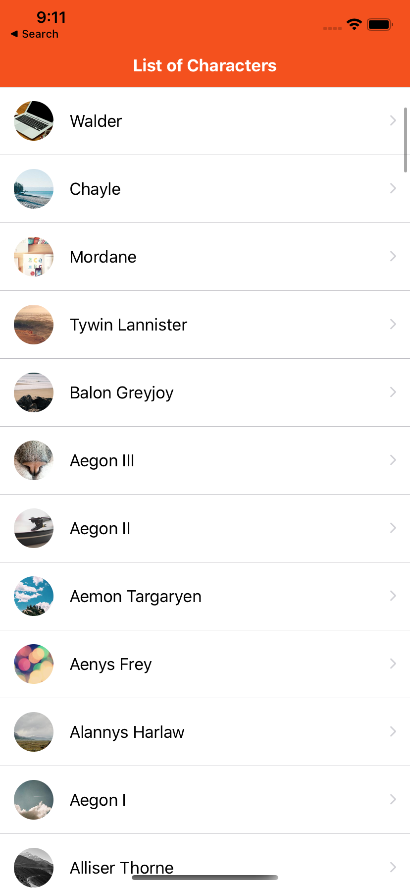
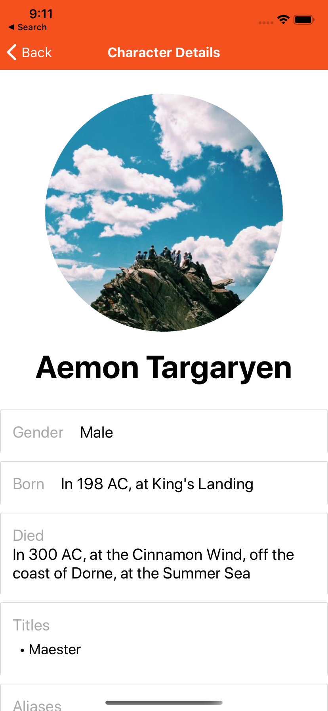

# An API of Ice and Fire
An simple react-native app which shows all the characters and characters details from the TV series <b>Game of Thrones</b>.


# How to run

* Run the command ```npm install``` on the root folder
* Run the command ```npm start ios``` or ```npm start android``` to start the project on the respective simulator


# Pictures
| Main Screen | Detail Screen |
| --- | --- |
|  ||


# License
MIT License
